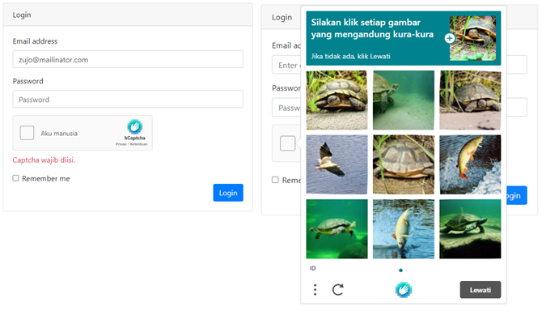

# hcaptcha

<p align="center"></p>

Paket hcaptcha sederhana untuk rakit framework.

## Instalasi
Jalankan perintah ini via rakit console:

```sh
php rakit package:install hcaptcha
```


## Mendaftarkan paket

Tambahkan kode berikut ke file `application/packages.php`:

```php
'hcaptcha' => ['autoboot' => true],
```

Tambahkan pesan kustom validasi berikut ke `application\language\en\validation.php`:

```php
'custom' => [
    'h-captcha-response_required' => 'Captcha is required.',
    'h-captcha-response_hcaptcha' => 'Captcha was invalid.',
],
```

Tambahkan juga ke `application\language\id\validation.php`:

```php
'custom' => [
    'h-captcha-response_required' => 'Captcha wajib diisi.',
    'h-captcha-response_hcaptcha' => 'Captcha tidak valid.',
],
```


## Cara penggunaan

**1. Membuat akun hcaptcha**

Daftarkan akun hcaptcha anda [disini](https://dashboard.hcaptcha.com/signup)
untuk mendapatkan hcaptcha sitekey dan hcaptcha secret.


**2. Edit file `packages/hcaptcha/config/main.php` dan tambahkan kredenislal anda:**

```php
return [
    'sitekey' => 'hcaptcha sitekey anda disini',
    'secret' => 'hcaptcha secret anda disini',
];
```


**3. Menampilkan gambar hcaptcha di view:**

```blade
<!-- Tambahkan ini di dalam form anda -->
{!! Esyede\Hcaptcha::show() !!}

<!-- Tambahkan juga js hcaptcha di bagian footer -->
{!! Esyede\Hcaptcha::js() !!}
```


**4. Validasi hcaptcha di controller:**

```php
$validation = Validator::make(Input::all(), [
    // ...
    'h-captcha-response' => 'required|hcaptcha',
    // ...
]);

if ($validation->fails()) {
    return Redirect::back()
        ->with_input()
        ->with_errors($validation);
}
```


## Lisensi

Paket ini dirilis dibawah [Lisensi MIT](https://github.com/esyede/hcaptcha/blob/master/LICENSE)
